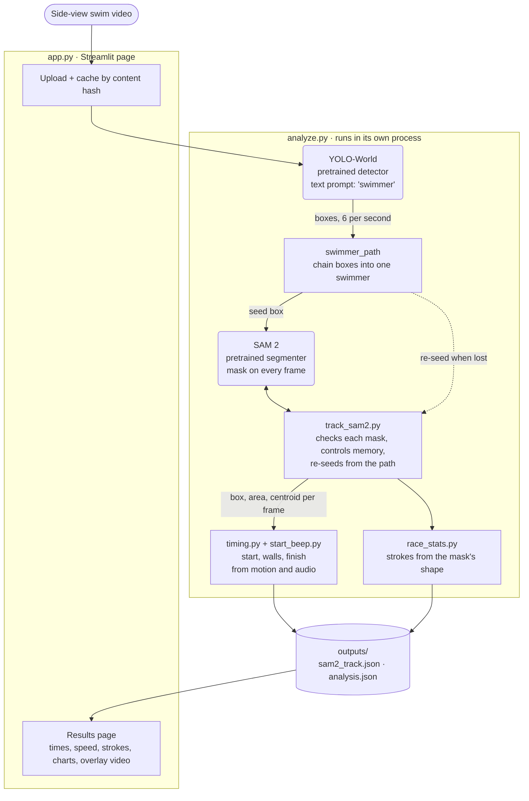

# Swimline: system overview

Rounded boxes are the two pretrained models; square boxes are our code.
Details are in [technical.md](technical.md).

```mermaid
flowchart TD
    video(["Side-view swim video"])

    subgraph app["app.py · Streamlit page"]
        upload["Upload + cache by content hash"]
        page["Results page<br/>times, speed, strokes, charts, overlay video"]
    end

    subgraph analyze["analyze.py · runs in its own process"]
        yolo("YOLO-World<br/>pretrained detector<br/>text prompt: 'swimmer'")
        path["swimmer_path<br/>chain boxes into one swimmer"]
        sam("SAM 2<br/>pretrained segmenter<br/>mask on every frame")
        track["track_sam2.py<br/>checks each mask, controls memory,<br/>re-seeds from the path"]
        timing["timing.py + start_beep.py<br/>start, walls, finish<br/>from motion and audio"]
        stats["race_stats.py<br/>strokes from the mask's shape"]
    end

    files[("outputs/<br/>sam2_track.json · analysis.json")]

    video --> upload --> yolo
    yolo -- "boxes, 6 per second" --> path
    path -- "seed box" --> sam
    sam <--> track
    path -. "re-seed when lost" .-> track
    track -- "box, area, centroid per frame" --> timing
    track --> stats
    timing --> files
    stats --> files
    files --> page
```
